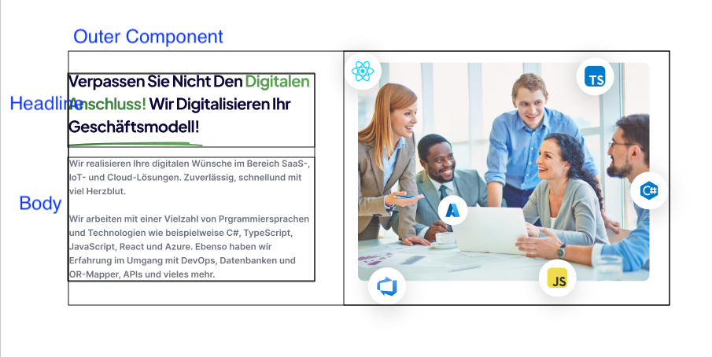

# Coding Guide

This is the coding guide from Handmade Systems. It's a living document and will be updated from time to time.

We are following standards and best practises but also have our own rules. The rules are based on our experience and are not set in stone. If you have a better idea, please let us know.

## HTML Style guide
- Don't only use DIVs and SPANs
- Do use semantic HTML tags like header, footer, section, article for SEO
- Use a correct structure of h1, h2, h3 tags for SEO

## TypeScript

- use arrow functions where possible
- don't use default export, when it's possible

## NextJs

- add tests for your functions
- for components, add stories and snapshot them in a test

### Template for component

```typescript jsx
import { FC } from "react";

export interface $name$Props {
}

export const $name$: FC<$name$Props> = () => (
  <>
  </>
)

```

### Template for story

```typescript jsx
import type { Meta, StoryObj } from '@storybook/react'

import { $component$ } from './$path$'

const meta: Meta<typeof $component$> = {
  title: '$storypath$/$component$',
  component: $component$,
  tags: ['autodocs']
}

export default meta

type Story = StoryObj<typeof $component$>

export const Default: Story =  {
    args: {
    }
}
```

### Template for storybook-test

```typescript jsx
import { render } from '@testing-library/react'

import { $component$, $component$Props } from './$path$'
import { Default } from './$path$.stories'

describe('$component$', () => {
  it('renders without errors', () => {
    const { container } = render(<$component$ {...(Default.args as $component$Props)} />)
    expect(container).toMatchSnapshot()
  })
})

```

### Template for function-test

```typescript jsx
describe('$name$', () => {
  it('should not explode', () => {
    const result = $name$;
    expect(result).toBeDefined();
  })
})
```

# Tailwind and CSS Styleguide & Rules

- all images inside ratio container
- use margins and paddings only on the outermost elements, components should be without any outer paddings/margins
  
    - The outer component should as tall as the tallest component inside it
    - as the image on the right is bigger the text on the left, the text should be vertically centered e.g. using flexbox or cssgrid
    - headline and body itself also have no margins/paddings
    - the margin between the components is defined by the outermost container or by css-selectors
        - for example the headline, subline, body is used everywhere in the page, so this components should be reused and flagged with a real css class
        - the margin between the components should be defined then by global selectors which can be overwritten by special components.
          also for specials like headline+button,...

      ## Example
      ```css
      .headline + .subline {
          @apply mt-4;
      }
      
      .subline + .body,
      .headline + .body {
          @apply mt-2;
      }
      ```
- as described above, the components should be reusable and have no margins/paddings. comp a and b are within the black frame.
  the margin between the components is defined by css-selectors e.g.


 ```css
 .component + .component {
     @apply mt-8;
 }
 ```
- also the component has no background color, this is defined by the outermost container. for example you can use the nth-child selector to define the background color of every second component
  ```css
  .component:nth-child(even) {
      @apply bg-gray-100 py-4;
  }
  ```
- so with the cms you can add as many components as you want and the styling is done by the css selectors. but here you must aware
  that those components with background color must also define a padding in order to fit the design

- avoid using fixed heights / widths, use flexbox or cssgrid instead
- avoid using fixed font sizes, use the tailwindcss font sizes instead
- avoid using pixel sizes, use gap, padding, margin, width, height, ... from tailwindcss instead
- reuse components as much as possible (if there is a title or button inside a component, use the headline or button component instead of creating a new one, or apply the same style)
- if you find behaviors in the design, like rounded corners, shadows, ... use tailwinds functions & directives to apply them, or create a custom style for it. avoid copy & paste classes,
- because it will make it difficult to maintain when changing something globally

# Useful links

- [@handmade-systems/eslint-plugin](https://github.com/Handmade-Systems/eslint-plugin) - Our custom eslint plugin with a predefined set of rules
- [@handmade-systems/prettier-config](https://github.com/Handmade-Systems/prettier-config) - Our custom prettier config